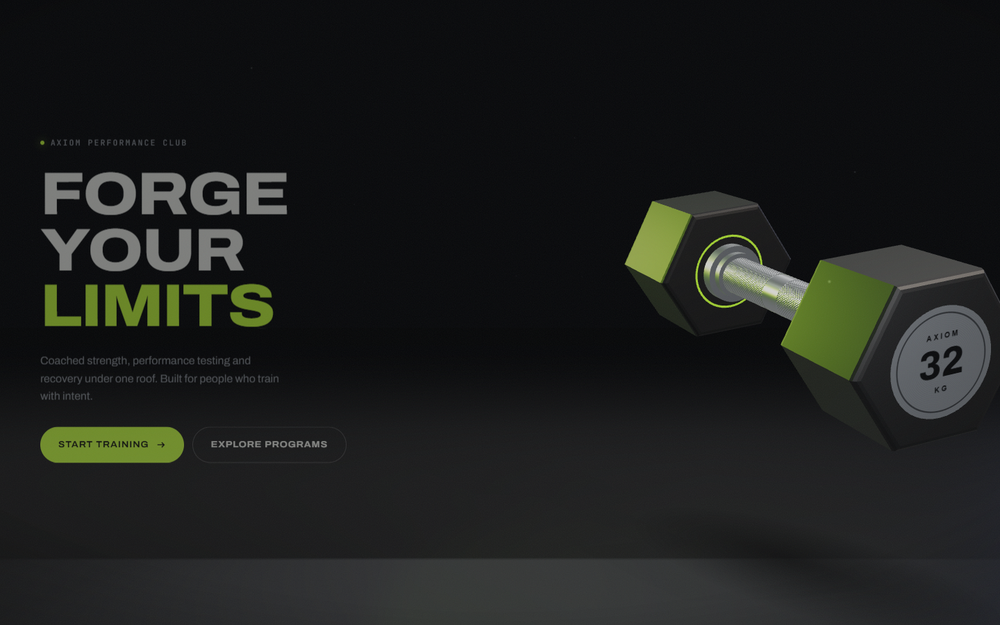
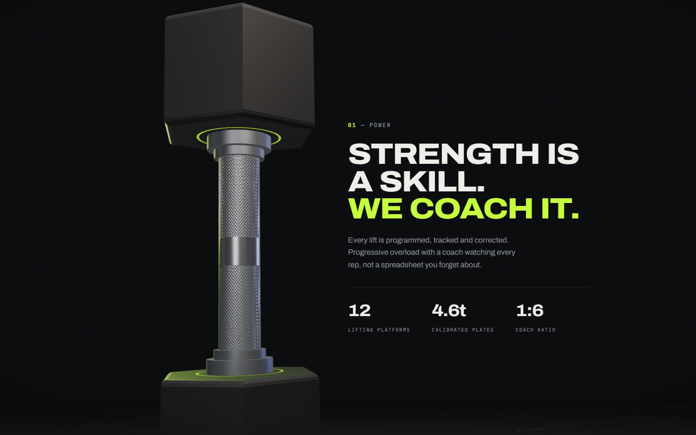
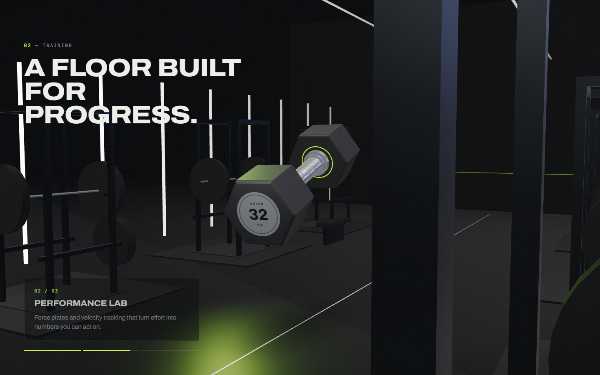
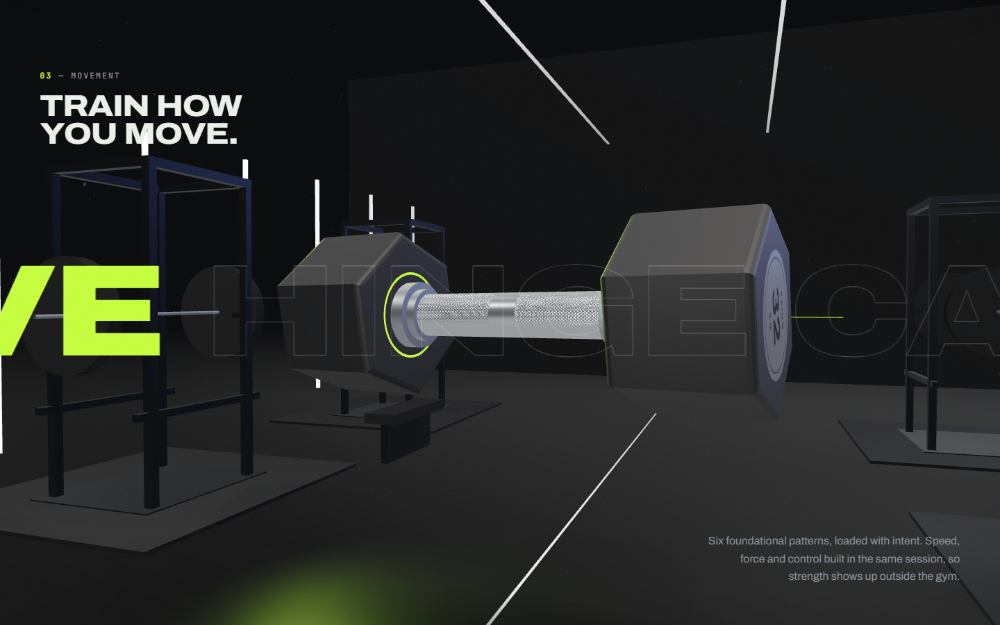
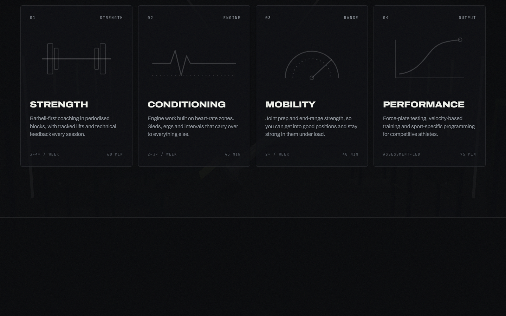
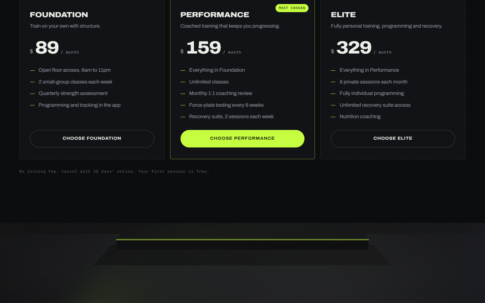
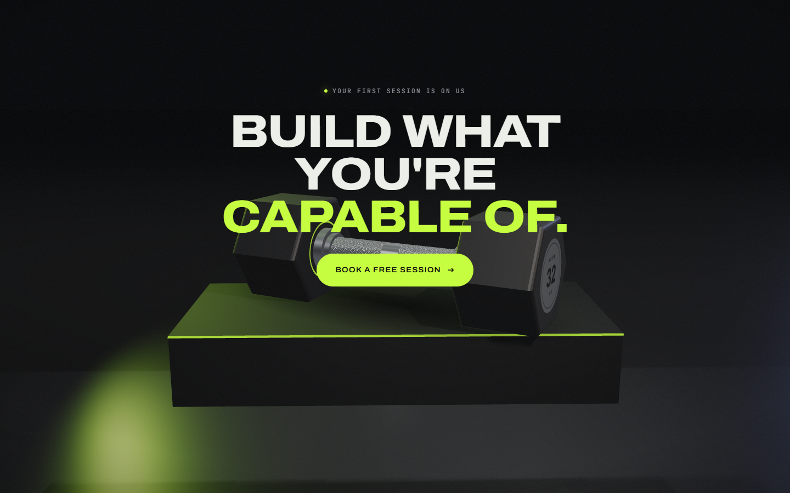
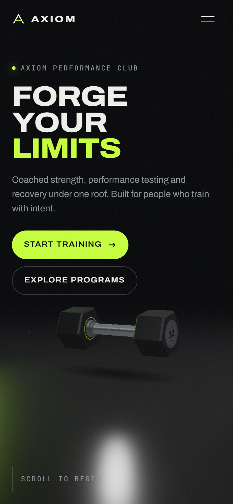

# AXIOM — Performance Club

A cinematic, scroll-driven 3D gym campaign site. One continuous camera move around a procedural 32 kg hex dumbbell, built with Vite, vanilla ES modules, Three.js, GSAP and ScrollTrigger.

**Live demo:** https://usman552.github.io/3D-Gym-site/



## Screenshots

| Power | Training |
|---|---|
|  |  |
| **Movement** | **Programs** |
|  |  |
| **Membership** | **Final** |
|  |  |

<p align="center"></p>

## How to run

Requirements: [Node.js](https://nodejs.org/) 18 or newer.

```bash
git clone https://github.com/Usman552/3D-Gym-site.git
cd 3D-Gym-site
npm install
npm run dev       # http://localhost:5173
```

Other scripts:

```bash
npm run build     # production build in dist/
npm run preview   # serve the build locally
```

## Deployment

Every push to `main` builds the site and deploys it to GitHub Pages through [.github/workflows/deploy.yml](.github/workflows/deploy.yml). `vite.config.js` uses a relative `base`, so the build works under the `/3D-Gym-site/` path.

## The idea: one object, one take

The page is a single continuous camera move around one hero object, a procedural 32 kg hex dumbbell. Sections are beats in that shot:

| Beat | Camera | Object | Light / atmosphere |
|---|---|---|---|
| Hero | Slow push-in | Floats right of the headline, breathes, rolls toward the edge | Warm key; lime rim swells |
| Power | Drops to a low angle, slow orbit | Sweeps across, stands vertical, scales up | Key hardens, fill drops |
| Training | Pulls back, then tracks laterally down the corridor | Floats through the gym | Fog thins to reveal racks, light columns, reflective floor |
| Movement | Wider lens, fast close passes | Rapid rotations with a ghost-trail motion blur scaled by scroll speed | Exposure lifts |
| Programs | Retreats | Recedes | Scene dims behind the cards |
| Membership | — | Restaged while hidden | Fully shaded; rendering pauses |
| Final | Settles into a frontal composition | Descends and rests flat on a rising plinth | Single key, lime rim |

## Architecture

```
src/
  main.js                    boot: quality detection, UI, lazy 3D import, loader
  styles/main.css            design tokens, layout, responsive rules
  animation/
    timeline.js              THE SHOT LIST: every 3D keyframe, per beat (desktop + mobile values)
    KeyframeTrack.js         reusable numeric keyframe track (partial frames, per-segment easing)
    choreography.js          ScrollTrigger measures beats → absolute scroll keyframes
    sections.js              scrubbed typography + entrance animations
    reveal.js                reusable reveal helpers (line mask, rise, count-up)
  scene/
    Experience.js            render loop: sample → damp → apply → render
    renderer.js              WebGLRenderer (ACES, sRGB, shadows by tier)
    camera.js                camera rig: parallax, portrait FOV compensation
    lighting.js              key / lime rim / fill / cursor light, following the subject
    dumbbell.js              procedural PBR dumbbell + motion-trail ghosts
    studio.js                floor (+ mirror on high tier), contact shadow, plinth, dust
    gym.js                   training environment (lazy-loaded, instanced, merged)
    textures.js              procedural canvas textures (knurl, end cap, radial)
  ui/                        nav, magnetic buttons, card tilt, pricing toggle, loader
  utils/                     device/quality tiers, math, rAF loop, pointer
```

### How the scroll system works

1. `timeline.js` describes keyframes as `[beat, progress]` with only the values that change.
2. `choreography.js` creates one ScrollTrigger per beat to measure its scroll range, then converts every keyframe into an absolute scroll position. It rebuilds on every ScrollTrigger refresh, so resizes and breakpoint changes stay correct.
3. Each frame, `Experience` samples the track at the current scroll and damps the live state toward it. The result is one continuous, jump-free timeline across the whole page, not a separate animation per section.
4. Sections use CSS `position: sticky` stages, which pin without layout shifts and behave well with mobile browser chrome. ScrollTrigger scrubs the typography against the same ranges.

To retime the film, edit `timeline.js`. To change how long a beat lasts, change that section's height in `main.css`.

## Performance

- **Quality tiers** (`utils/device.js`). *High* gets shadow maps, a mirror floor, 260 dust motes and the full gym. *Mid* (tablets) has no mirror or shadows. *Low* (phones) also uses fewer racks, fewer segments and 60 motes.
- **Adaptive resolution.** The pixel ratio drops in 0.25 steps if frames average more than 25 ms.
- **Lazy loading.** The 3D layer is a dynamic import, and the gym is a second dynamic import loaded on idle after first paint.
- **No downloads for assets.** Geometry and textures are procedural; image-based lighting comes from `RoomEnvironment`, not an HDR file.
- **Render pausing.** Rendering stops completely while membership covers the scene, and the loop stops when the tab is hidden.
- **Few draw calls.** Racks are merged geometries; plates and light columns are instanced; glow uses unlit materials, so no extra lights.
- **No post-processing.** "Motion blur" is a 3-ghost transform trail plus a CSS echo layer; grain and vignette are static CSS.
- **Cheap DOM work.** Updates are transform/opacity only, the shade overlay is written only on change, and pointer listeners are passive.
- **`prefers-reduced-motion`.** It disables idle drift, parallax, magnetic/tilt, the trail and dust, turns travel reveals into fades and tightens the camera damping.
- **No WebGL.** The site falls back to a static, fully usable page.

## Swapping in a real model

`createDumbbell()` returns `{ group, inner }`. The choreography only moves `group`, so you can load a Draco- or Meshopt-compressed GLB with `GLTFLoader` and add it to `inner`. Keep it around 2.3 units long along X and centred on the origin, and the shot list will work unchanged.
